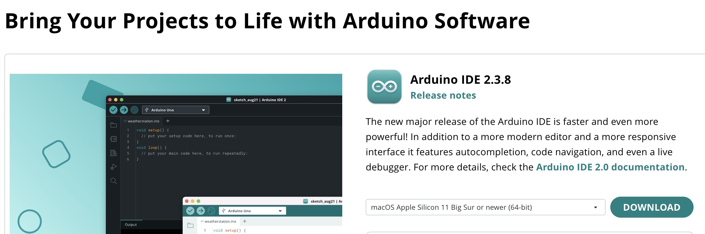
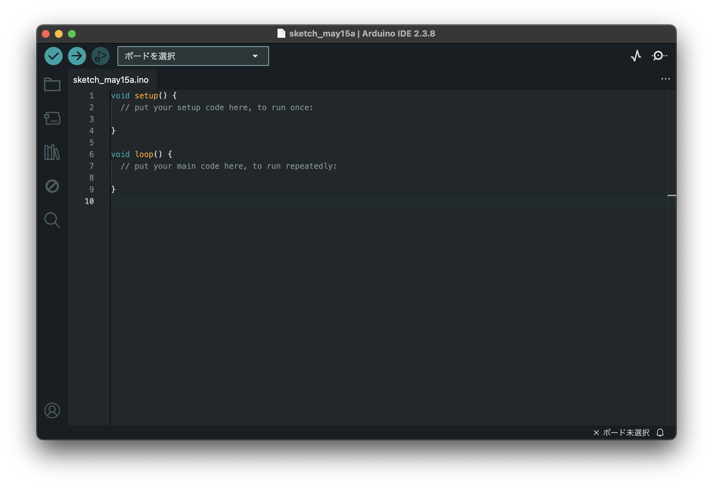
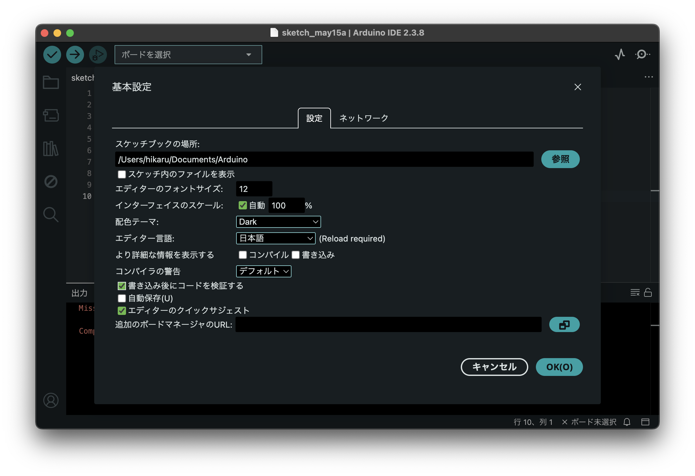
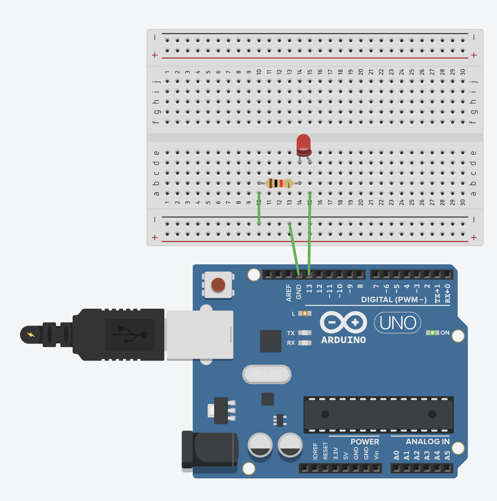
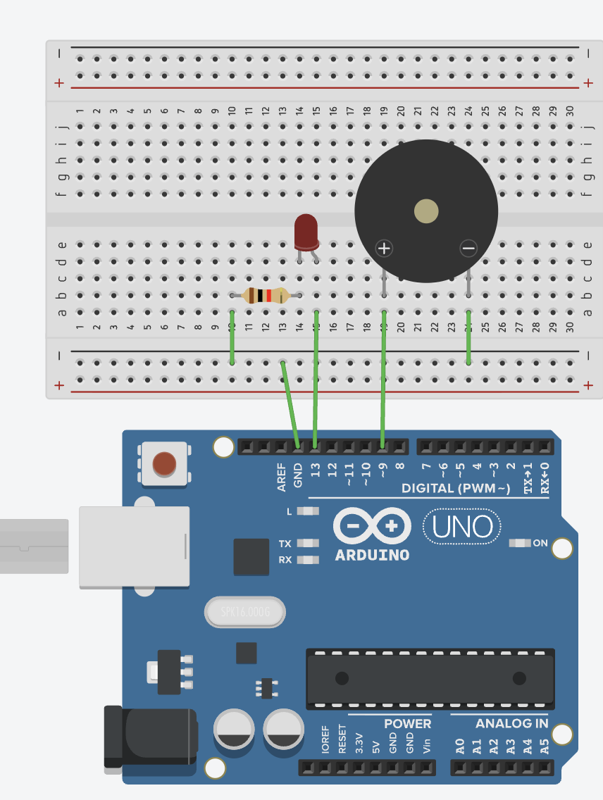
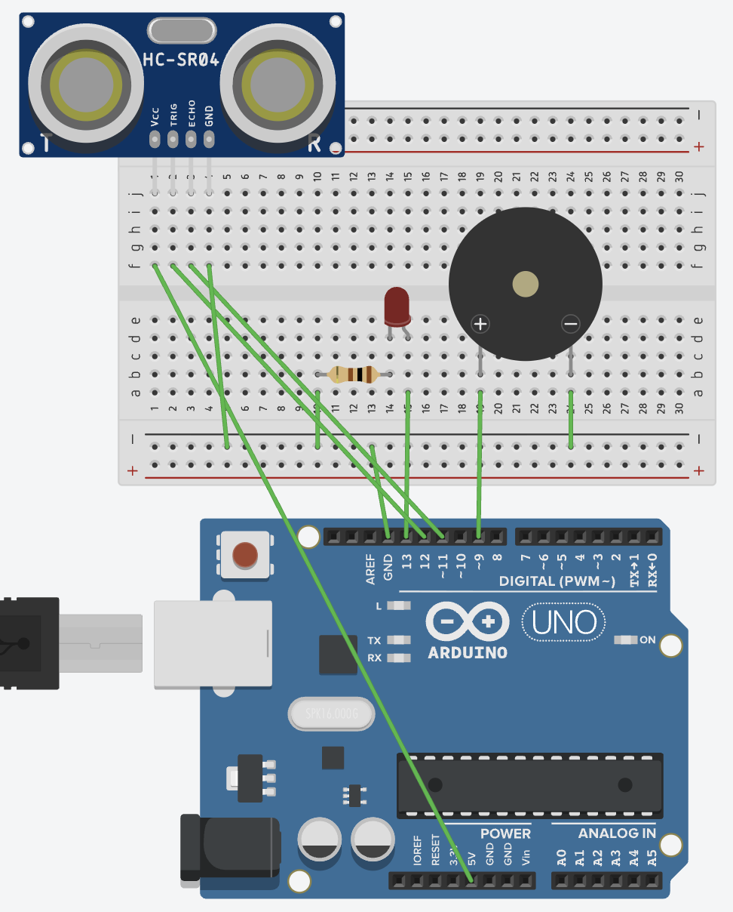

---
export_on_save:
    puppeteer: true # export PDF on save
    puppeteer: ["pdf"] 
    
---

# 番外実験：Arduino
本テキストは2026年5月時点の情報で構成されている。担当者は必要に応じて本テキストを更新すること。

本実験に関わる文書のライセンスはCC0 1.0 Universalである。担当者にはライセンスの変更も含めた全ての編集を認める。

## 概要

Arduinoは安価で扱いやすい代表的なマイコンボードの一つである。本実験では、Arduinoを用いてLEDを点滅させるプログラム、俗に「Lチカ」と呼ばれるものから始める。自主実験への応用を見据え、最終的にはセンサの値をPCに記録するデータロガーとしての利用を習得することを目標とする。

### 注意事項

ArduinoはC言語やC++をベースとしている。1年後期の基礎プログラミング演習でC言語を学んでいる場合は復習しつつ読んでいくとよい。

プログラミング未習得の場合は、以降の内容を授業時間内に理解することは難しいため、参考になるWebページの章で挙げた資料を参考に、事前にC言語の基礎を学んでおくとよい。ただし、書籍はバージョンなど細かい違いで混乱する可能性が高いため非推奨である。

## 環境構築

#### 初心者向け: Arduino IDEのインストール

[https://www.arduino.cc/en/software/](https://www.arduino.cc/en/software/)

開発に必要な機能が一通り揃っていて、GUIで簡単に設定ができる。以降の説明はこのソフトを使っている前提で進める。ある程度こうした開発に慣れている場合は後述のCLIやVSCodeの拡張機能を使ってもよい。

インストールは通常のソフトと同様に行う。
完了したら起動する。

#### ラボ外での確認方法：シミュレータ

https://www.tinkercad.com/

TinkercadはAutodesk社が提供する無料のオンライン3Dデザインツールである。電子工作のシミュレーション機能も備わっており、Arduinoをはじめとして様々な部品が使える。

#### 上級者向け1: Arduino CLI

[https://arduino.github.io/arduino-cli/installation/](https://arduino.github.io/arduino-cli/installation/)

#### 上級者向け2: PlatformIO

VSCode拡張機能

[https://marketplace.visualstudio.com/items?itemName=platformio.platformio-ide](https://marketplace.visualstudio.com/items?itemName=platformio.platformio-ide)

### Arduino IDEの設定

#### スケッチブックの場所

Arduinoのプログラムを保存する場所を指定する。

#### エディター言語

言語を日本語にすることができる。

#### コンパイラの警告

どれくらい厳しくエラーを出力するかを指定する。

`デフォルト`に設定するとよい。

#### 書き込み後にコードを検証する

ONにする。

#### 自動保存

勝手に上書きされたくなければOFF、保存し忘れを防止したければON。

#### エディターのクイックサジェスト

書いている途中で候補が出てくる機能。
ONにすると便利。

## 実験手順

### PCとArduinoの接続

USBケーブル(A to B)でPCとArduinoを接続し、Arduino IDEでボードを選択する。

→(右矢印)を押すとコードをArduinoに書き込む。

☑️(チェックマーク)では書き込まずにコードの文法チェックのみを行う。

### Arduinoプログラミングの基本

@import "src/blank.ino"

この`void setup()`と`void loop()`という関数の定義だけを行い、具体的な動作を何も指定しないコードを書き込む(右矢印のマークをクリック)。

完了しても何も起こらないが、正常である。IDE下部の出力にエラーが出ていないことを確認する。

### Lチカ：LEDを点滅させる

ArduinoにはGPIOという外部との接続ポートが多数備わっている。これを使ってLEDを点滅させる「Lチカ」はArduino学習における"Hello World"的立ち位置のプログラムである。

@import "src/LED_blink.ino"

### スピーカーを鳴らす

@import "src/beep.ino"

### PWM制御

@import "src/pwm.ino"

回路はそのまま。

信号のONとOFFを繰り返す矩形波において、ONの時間の割合をデューティ比という。これを調整することでLEDが駆動するのに必要な電圧を維持しながら明るさを下げることができる。

[PWM制御とは？原理や使用例をわかりやすく解説 株式会社ニッポー](https://www.nippo-co.com/odm-kiban/odm-012/)

### センサー・シリアル通信

超音波センサーは発信した超音波が物体に反射して戻ってくるまでの時間を計測することで、その物体までの距離を計測することができる。

@import "src/sensor.ino"

書き込んだ後、Arduino IDE上部の虫眼鏡マークをクリックし、シリアルモニタを開くと超音波センサーからの距離が表示される。

#### シリアル通信を保存する（Windows）

[シリアルデータの受信](https://qiita.com/its_kun/items/fefa1fa357cbc2c2f4e1#%E3%82%B7%E3%83%AA%E3%82%A2%E3%83%AB%E3%83%87%E3%83%BC%E3%82%BF%E3%81%AE%E5%8F%97%E4%BF%A1)

#### シリアル通信を保存する（Mac）

[とにかく最速でSerial通信のログをファイルに残す](https://qiita.com/akaneburyo/items/54ab07bd755058514375)

### センサーを使ったリアルタイム制御

超音波センサーが検知した距離に応じてLEDの明るさとスピーカーの音量を変更する。

@import "src/pwm_sensor.ino"

## 課題

いろいろなパラメータを変えてみる。

* 出力するパーツ(LED、スピーカー)
* 入力するパーツ(超音波センサー、ボタン)
* toneの周波数やデューティ比

## 参考になるWebページ

* Arduino言語日本語リファレンス [https://www.musashinodenpa.com/arduino/ref/](https://www.musashinodenpa.com/arduino/ref/)
* 一週間で身につくC言語の基本 [https://c-lang.sevendays-study.com/index.html](https://c-lang.sevendays-study.com/index.html)